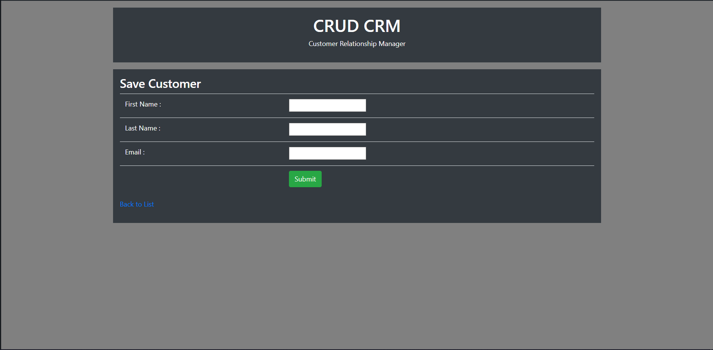

# CRUD-CRM

CRUD-CRM is a simple Customer Relationship Management Web Application using Spring MVC to Create,Update and Delete Customer with the help of Spring Framework and Hibernate. 

## Technologies
 * Java
 * Spring
 * Hibernate
 * JSP + JSTL
 * Bootstrap
 * MySQL

## ScreenShots

### List of Customers

### Add Customer

### Update Customer

### Delete Customer

